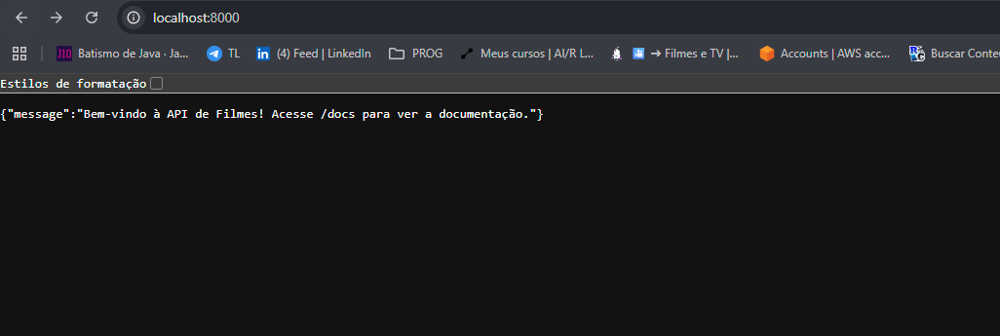
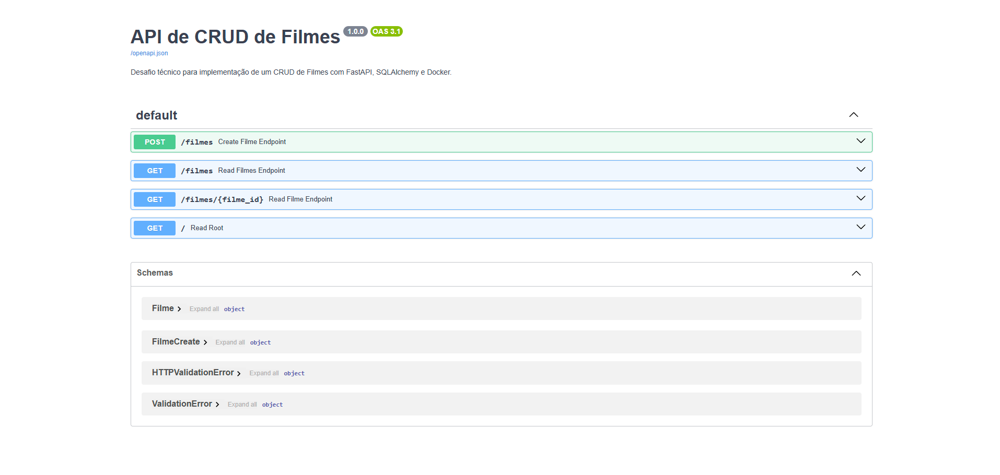

# Desafio CRUD de Filmes com FastAPI

Esta é uma implementação do desafio de CRUD de Filmes utilizando Python, FastAPI, SQLAlchemy (com SQLite) e Docker/Docker-compose.

A aplicação expõe uma API REST para criar e listar filmes, garantindo a persistência dos dados através de um volume Docker.

## Tecnologias Utilizadas

* **Python 3.10**
* **FastAPI**: Para a construção da API e documentação automática (Swagger/ReDoc).
* **Uvicorn**: Servidor ASGI para rodar o FastAPI.
* **SQLAlchemy**: ORM para interação com o banco de dados.
* **SQLite**: Banco de dados relacional file-based para persistência.
* **Docker & Docker-compose**: Para containerização da aplicação e gerenciamento da persistência de dados.

## Como Subir a Aplicação

### Pré-requisitos

* [Docker](https://www.docker.com/get-started) instalado.
* [Docker Compose](https://docs.docker.com/compose/install/) instalado (geralmente vem com o Docker Desktop).

### Passos para Execução

1.  Clone este repositório (ou o fork que você criou).
2.  Navegue até o diretório raiz do projeto (onde o arquivo `docker-compose.yml` está localizado).
3.  Execute o seguinte comando no seu terminal:

    ```bash
    docker-compose up --build
    ```

    * O comando `--build` força o Docker a construir a imagem a partir do `Dockerfile` na primeira execução (ou se houver mudanças nos arquivos).
    * Se preferir rodar em modo "detached" (em segundo plano), use `docker-compose up -d --build`.

4.  Pronto! A API estará rodando.

### Acessando a API

Após executar o `docker-compose up`, a API estará acessível nos seguintes endereços:

* **API (Raiz)**: [http://localhost:8000/](http://localhost:8000/):


* **Documentação Interativa (Swagger UI)**: [http://localhost:8000/docs](http://localhost:8000/docs):


* **Documentação Alternativa (ReDoc)**: [http://localhost:8000/redoc](http://localhost:8000/redoc):


### Endpoints Disponíveis

* `POST /filmes`: Cadastra um novo filme.
* `GET /filmes`: Retorna todos os filmes cadastrados.
* `GET /filmes/{id}`: Retorna um filme específico pelo seu ID.